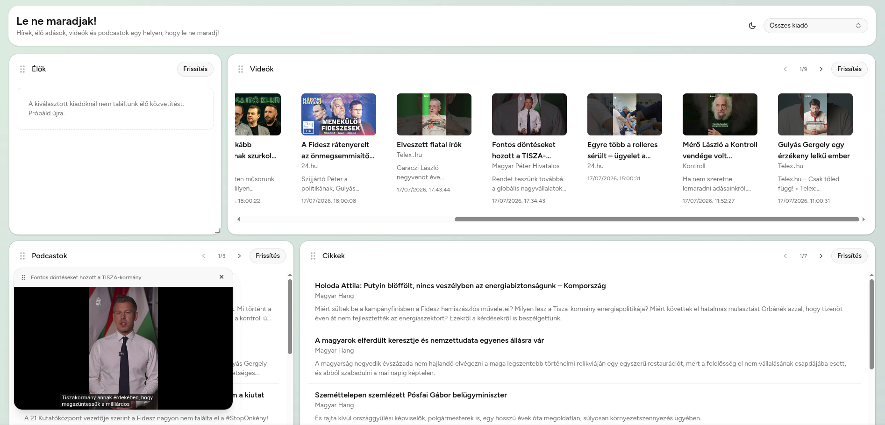

# Le ne maradjak

A dashboard for following Hungarian political news. Independent coverage is
scattered across many outlets and platforms — this pulls the live streams,
videos, podcasts, and articles from key independent publishers into one
customizable place.

**Live app:** https://lenemaradjak.web.app



## Features

- **Customizable widget grid** — drag, drop, and resize widgets
  (react-grid-layout); the layout persists across sessions.
- **Four content types** — live streams, YouTube videos, podcasts, and articles,
  each as its own widget.
- **Floating YouTube player** — keep a video playing while you rearrange or
  browse other widgets.
- **Per-publisher selection** — pick which of the publishers below each widget
  follows.

## Publishers

444 · Telex · Partizán · Kontroll · Magyar Hang · 24.hu · Válasz Online ·
Direkt36 · Magyar Péter (official channels)

## Tech stack

React 19 + TypeScript + Vite with the React Compiler enabled, shadcn + Tailwind
for UI, and react-grid-layout for the layout. A small Express proxy handles CORS
and YouTube API access, backed by Upstash Redis in production. Deployed on
Firebase Hosting with the proxy on Cloud Run.

## Getting started

Node.js 24 is required (`node --version` should show `v24.x`).

```bash
npm install
cp example.env .env   # fill in values
npm run dev
```

### Environment variables

| Variable                   | Required   | Description                                                                                                                                |
| -------------------------- | ---------- | ------------------------------------------------------------------------------------------------------------------------------------------ |
| `YOUTUBE_API_KEY`          | Proxy only | YouTube Data API v3 key, injected server-side so it never reaches the browser. Without it, YouTube widgets show a "not configured" message |
| `ALLOWED_ORIGIN`           | Proxy only | Origin the proxy allows CORS requests from (default: `http://localhost:5173`)                                                              |
| `DEV_CONTACT`              | Optional   | Contact address sent in the `User-Agent` header to upstream RSS servers                                                                    |
| `UPSTASH_REDIS_REST_URL`   | Optional   | Upstash Redis REST URL — enables shared cache and rate limits across proxy instances instead of per-instance memory                        |
| `UPSTASH_REDIS_REST_TOKEN` | Optional   | Upstash Redis REST token, used together with `UPSTASH_REDIS_REST_URL`                                                                      |

## Commands

```bash
npm run dev          # Vite dev server
npm run build        # Production build
npm run lint         # ESLint
npm run format       # Prettier (write)
npm run format:check # Prettier (check only)
npm test             # Vitest
npx tsc --noEmit     # Type-check without emitting
```

## Development proxy

Some RSS feeds don't send CORS headers, and the YouTube API key must stay
server-side, so the app routes those requests through a local proxy
(`server/proxy-server.js`).

```bash
npm run dev:all      # Vite dev server + proxy container (recommended)
npm run start:server # Proxy with bare Node (no Docker)
```

The proxy listens on port 3001. If it isn't running, some feed requests fail in
the browser.

**Security posture:** a single shared host allowlist
(`src/lib/proxy-hosts.json`, imported by both the client and the proxy) limits
which upstream domains can be requested, and redirects are followed manually and
re-validated against it. The proxy adds per-IP rate limiting (200 req / 15 min),
per-host upstream limiting (15 req / 60 s), a 5 MB response cap, a 10-second
timeout, and CORS locked to `ALLOWED_ORIGIN`.

## Architecture

- **Widgets** live in `src/components/dashboard/widgets/`. Each renders inside a
  `DashboardCard` and pulls data through `useRSSFeed` (articles, podcasts) or
  `useYouTubeData` (videos, live streams). Publisher config is in
  `src/lib/publisher-config.ts`.
- **Proxy** (`server/`) fronts the RSS and YouTube requests, sharing a cache and
  rate limiter that run on Upstash Redis in production and fall back to
  in-memory automatically when Redis env vars are absent.

### Deployment

Firebase Hosting serves the Vite SPA; requests to `/api/**` are rewritten to a
Cloud Run service (`lenemaradjak-proxy`, `europe-west1`). Upstash Redis provides
shared cache (30 min TTL for googleapis.com, 15 min otherwise) and rate-limit
state that survive Cloud Run scale-down.

`YOUTUBE_API_KEY` is not a GitHub secret — it lives in GCP Secret Manager and is
injected into Cloud Run at deploy time, so it never appears in the client build.

**CI/CD** (`.github/workflows/`):

- `ci.yml` — lint, format check, tests, and build on PRs and non-`master`
  pushes.
- `security.yml` — gitleaks secret scanning and Trivy image vulnerability scans.
- `deploy.yml` — on push to `master`, builds and deploys the Hosting SPA and the
  Cloud Run proxy in parallel.

Required GitHub secrets: `GCP_SA_KEY`, `FIREBASE_SERVICE_ACCOUNT`,
`DEV_CONTACT`.

## Testing

```bash
npm test
```

[Vitest](https://vitest.dev/) with jsdom. Coverage spans hooks, fetchers,
utilities, widgets, and the proxy server — see the test files co-located with
each source file.
